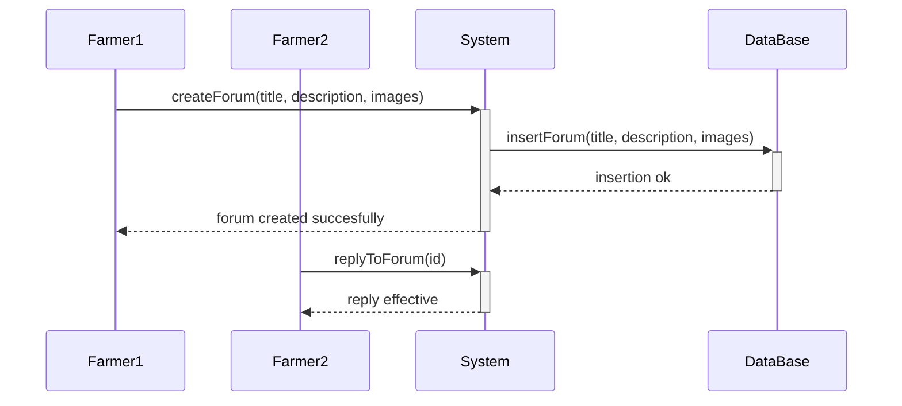
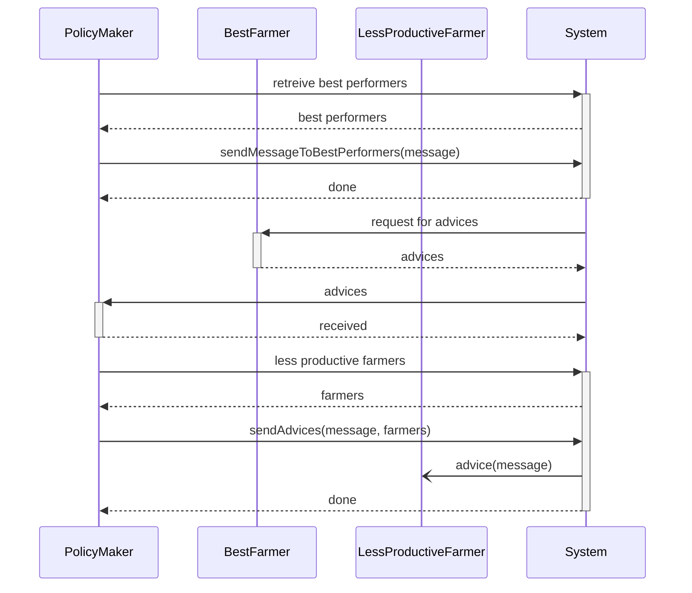

# UML diagram test

```mermaid
sequenceDiagram
    participant Farmer1
    participant Farmer2
    participant System
    participant DataBase
    Farmer1->>+System: createForum(title, description, images)
    System->>+DataBase: insertForum(title, description, images)
    DataBase-->>-System: insertion ok
    System-->>-Farmer1: forum created succesfully

    Farmer2->>+System: replyToForum(id)
    System-->>-Farmer2: reply effective
```

```mermaid
sequenceDiagram
    participant PolicyMaker
    participant BestFarmer
    participant LessProductiveFarmer
    participant System
    PolicyMaker->>+System: retreive best performers
    System-->>PolicyMaker: best performers
    PolicyMaker->>System: sendMessageToBestPerformers(message)
    System-->>-PolicyMaker: done

    System->>+BestFarmer: request for advices
    BestFarmer-->>-System: advices

    System->>+PolicyMaker: advices
    PolicyMaker-->>-System: received
    PolicyMaker->>+System: less productive farmers
    System-->>PolicyMaker: farmers 
    PolicyMaker->> System: sendAdvices(message, farmers)
    System-)LessProductiveFarmer: advice(message)
    System-->>-PolicyMaker: done
```