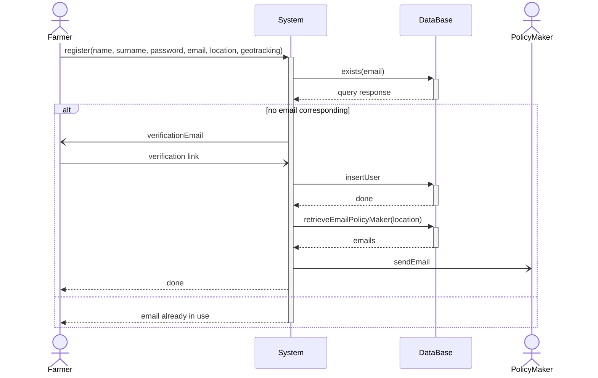
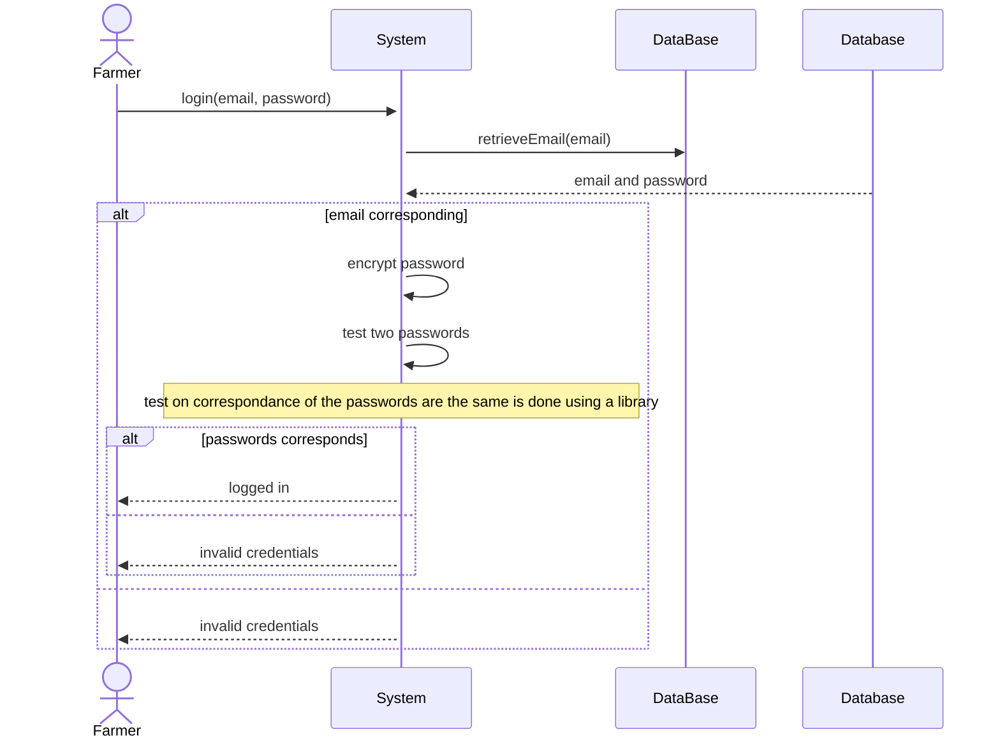
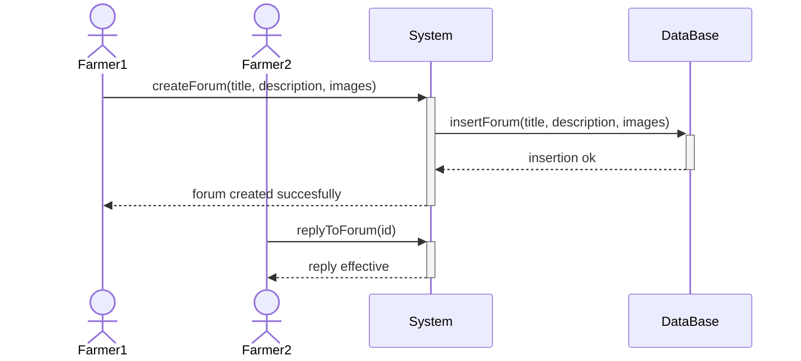
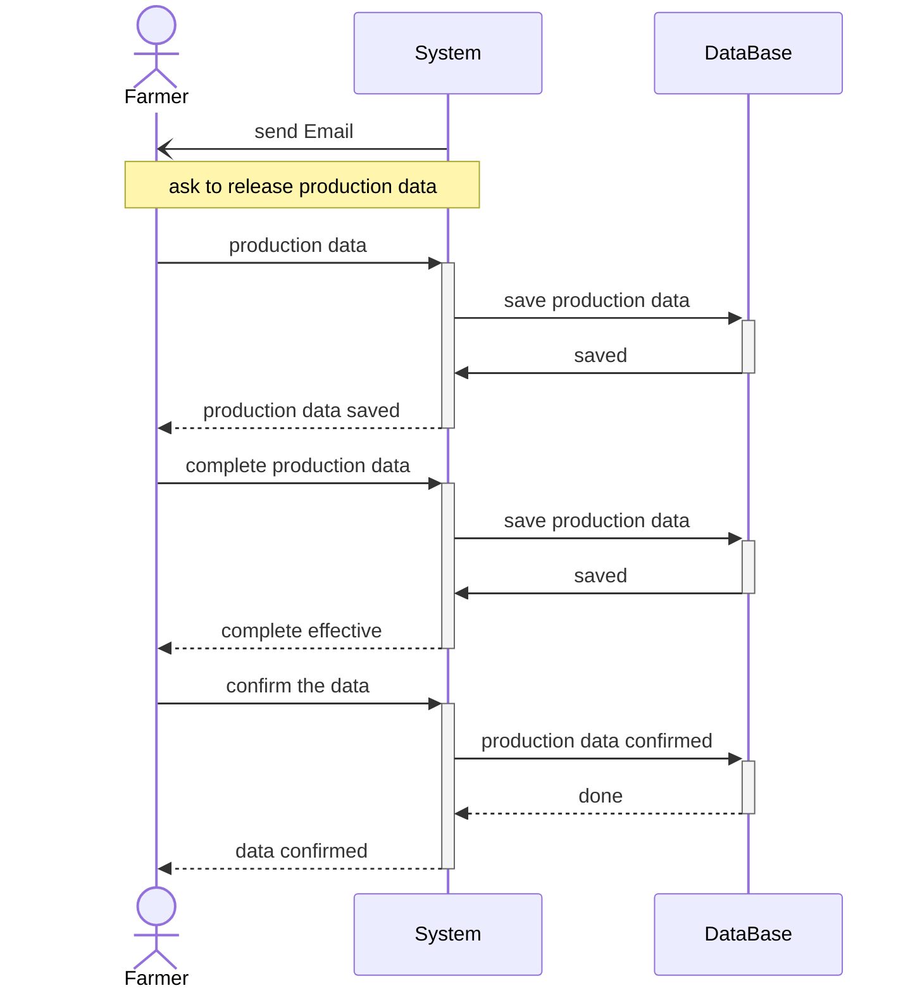
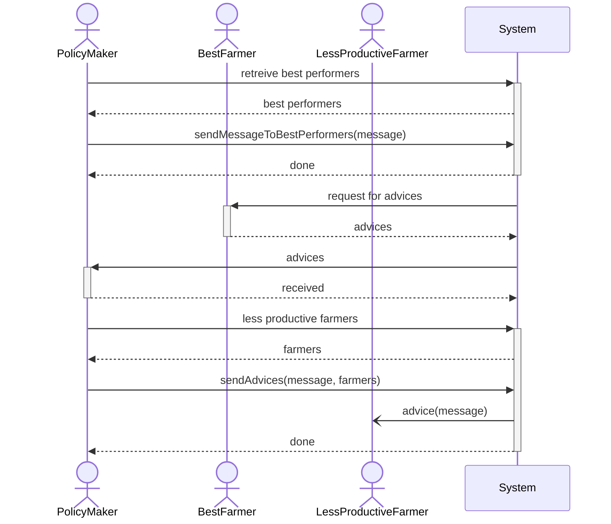
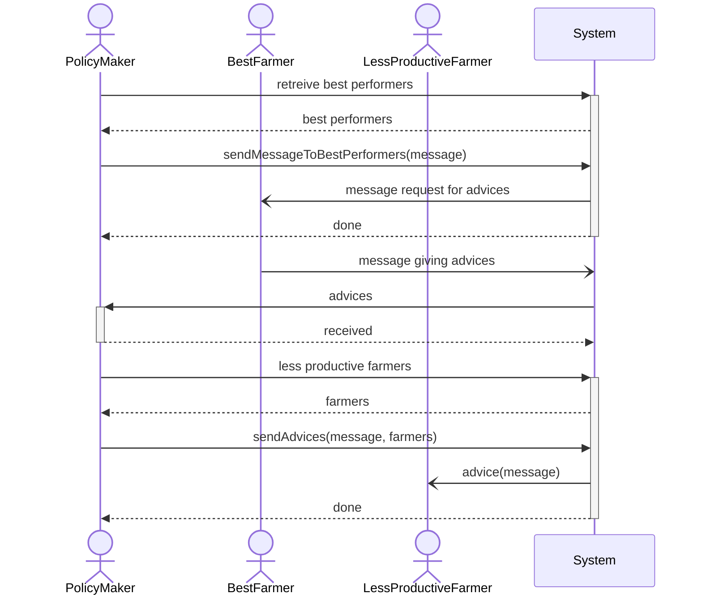
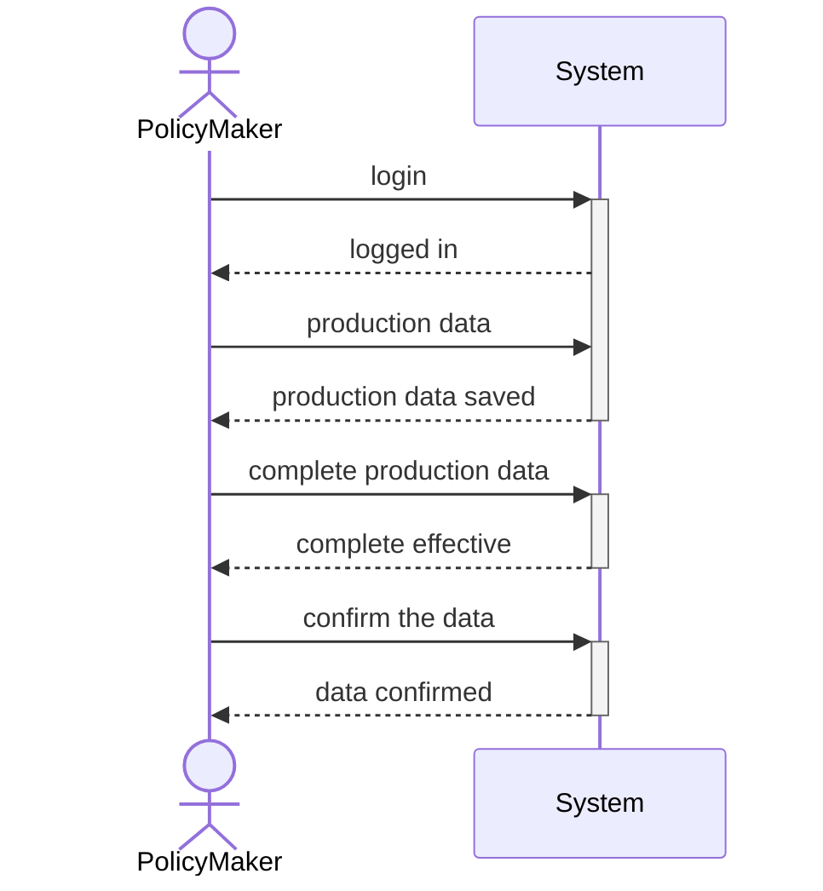

# UML diagram
## registration

## login

## production release
No need to do it, too simple case

## Forum Creation

## Request for Production Data

## Contact farmers

### v2 more in accordance to the use cases

## help request

