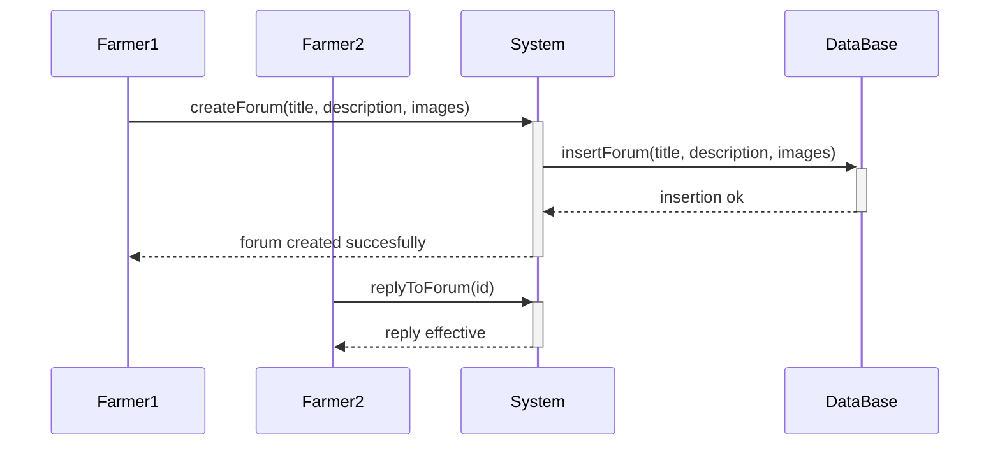
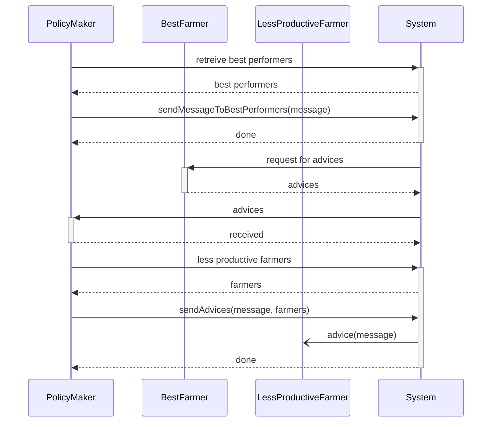
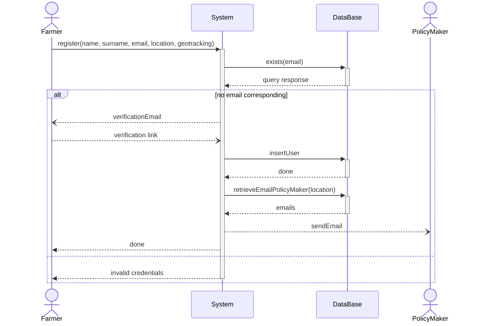

# UML diagram test

```mermaid
sequenceDiagram
    participant Farmer1
    participant Farmer2
    participant System
    participant DataBase
    Farmer1->>+System: createForum(title, description, images)
    System->>+DataBase: insertForum(title, description, images)
    DataBase-->>-System: insertion ok
    System-->>-Farmer1: forum created succesfully

    Farmer2->>+System: replyToForum(id)
    System-->>-Farmer2: reply effective
```

```mermaid
sequenceDiagram
    participant PolicyMaker
    participant BestFarmer
    participant LessProductiveFarmer
    participant System
    PolicyMaker->>+System: retreive best performers
    System-->>PolicyMaker: best performers
    PolicyMaker->>System: sendMessageToBestPerformers(message)
    System-->>-PolicyMaker: done

    System->>+BestFarmer: request for advices
    BestFarmer-->>-System: advices

    System->>+PolicyMaker: advices
    PolicyMaker-->>-System: received
    PolicyMaker->>+System: less productive farmers
    System-->>PolicyMaker: farmers 
    PolicyMaker->> System: sendAdvices(message, farmers)
    System-)LessProductiveFarmer: advice(message)
    System-->>-PolicyMaker: done
```

## registration

```mermaid
sequenceDiagram
    actor Farmer
    participant System
    participant DataBase
    actor PolicyMaker
    Farmer->>+System: register(name, surname, email, location, geotracking)
    System->>+DataBase: exists(email)
    DataBase-->>-System: query response
    alt no email corresponding
        System--)Farmer: verificationEmail
        Farmer--)System: verification link
        System->>+DataBase: insertUser
        DataBase-->>-System: done
        System->>+DataBase: retrieveEmailPolicyMaker(location)
        DataBase-->>-System: emails
        System--)PolicyMaker: sendEmail
        System-->>Farmer: done
    else
        System-->>-Farmer: invalid credentials
    end
```
