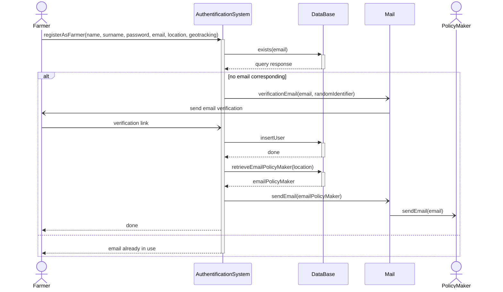
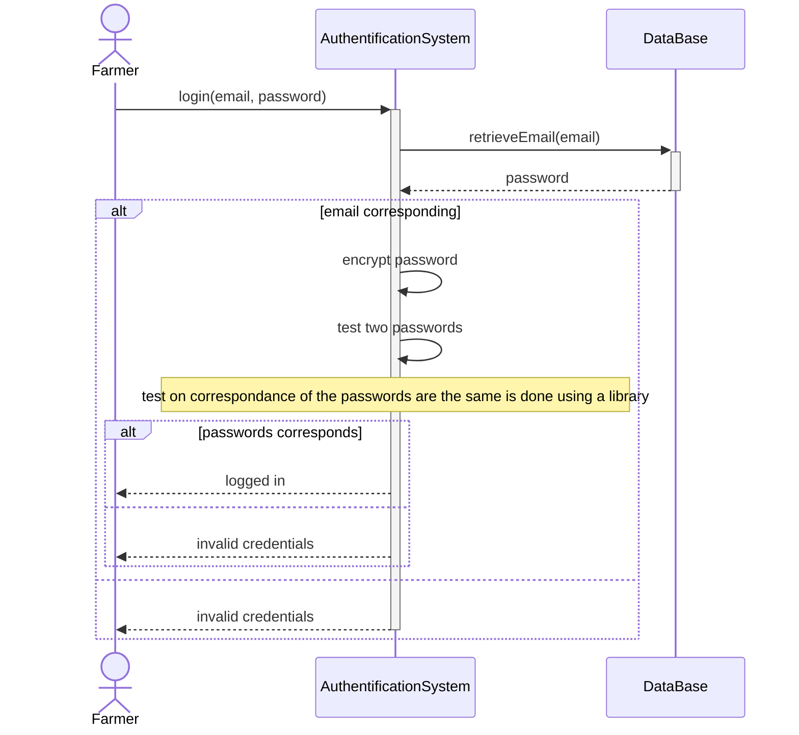
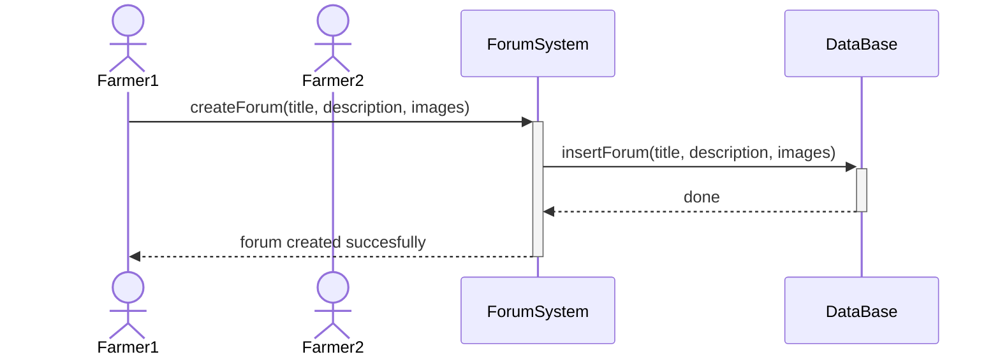
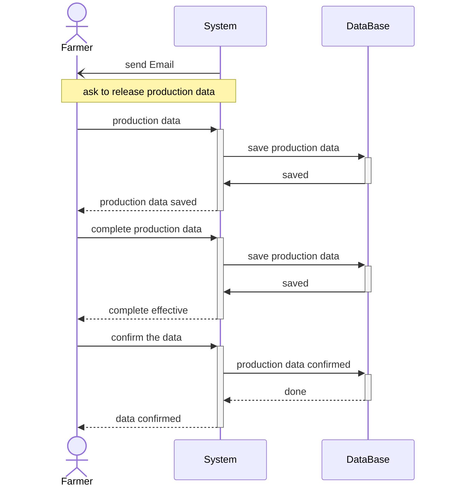
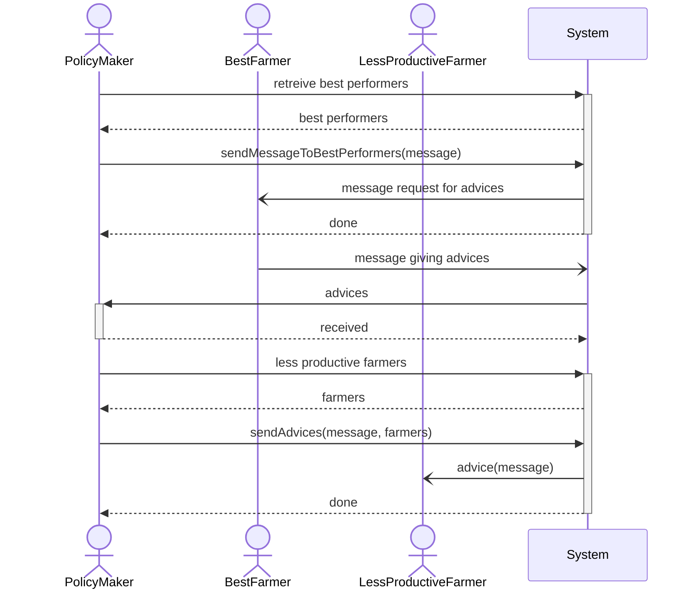

# UML diagram
## registration

```mermaid
sequenceDiagram
    actor Farmer
    participant AuthentificationSystem
    participant DataBase
    participant Mail
    actor PolicyMaker
    Farmer->>+AuthentificationSystem: registerAsFarmer(name, surname, password, email, location, geotracking)
    AuthentificationSystem->>+DataBase: exists(email)
    DataBase-->>-AuthentificationSystem: query response
    alt no email corresponding
        AuthentificationSystem-)Mail: verificationEmail(email, randomIdentifier)
        Mail-)Farmer: send email verification
        Farmer-)AuthentificationSystem: verification link
        AuthentificationSystem->>+DataBase: insertUser
        DataBase-->>-AuthentificationSystem: done
        AuthentificationSystem->>+DataBase: retrieveEmailPolicyMaker(location)
        DataBase-->>-AuthentificationSystem: emailPolicyMaker
        AuthentificationSystem-)Mail: sendEmail(emailPolicyMaker)
        Mail-)PolicyMaker: sendEmail(email)
        AuthentificationSystem-->>Farmer: done
    else
        AuthentificationSystem-->>-Farmer: email already in use
    end
```
## login

```mermaid
sequenceDiagram
    actor Farmer
    participant AuthentificationSystem
    participant DataBase
    Farmer->>+AuthentificationSystem: login(email, password)
    AuthentificationSystem->>+DataBase: retrieveEmail(email)
    DataBase-->>-AuthentificationSystem: password
    alt email corresponding
        AuthentificationSystem->>AuthentificationSystem: encrypt password
        AuthentificationSystem->>AuthentificationSystem: test two passwords
        Note over AuthentificationSystem,AuthentificationSystem: test on correspondance of the passwords are the same is done using a library
        alt passwords corresponds
            AuthentificationSystem-->>Farmer: logged in
        else
            AuthentificationSystem-->>Farmer: invalid credentials
        end
    else
        AuthentificationSystem-->>-Farmer: invalid credentials
    end
```

## Forum Creation

```mermaid
sequenceDiagram
    actor Farmer1
    actor Farmer2
    participant ForumSystem
    participant DataBase
    Farmer1->>+ForumSystem: createForum(title, description, images)
    ForumSystem->>+DataBase: insertForum(title, description, images)
    DataBase-->>-ForumSystem: done
    ForumSystem-->>-Farmer1: forum created succesfully
```

## Request for Production Data

```mermaid
sequenceDiagram
    actor Farmer
    participant System
    System -) Farmer: send Email
    Note over System, Farmer: ask to release production data
    Farmer ->>+System: production data
    System ->>+DataBase: save production data
    DataBase->>-System: saved
    System-->>-Farmer: production data saved
    Farmer->>+System: complete production data
    System ->>+DataBase: save production data
    DataBase->>-System: saved
    System-->>-Farmer: complete effective
    Farmer->>+System: confirm the data
    System->>+DataBase: production data confirmed
    DataBase-->>-System: done
    System-->>-Farmer: data confirmed
```

## Contact farmers

```mermaid
sequenceDiagram
    actor PolicyMaker
    actor BestFarmer
    actor LessProductiveFarmer
    participant System
    PolicyMaker->>+System: retreive best performers
    System-->>PolicyMaker: best performers
    PolicyMaker->>System: sendMessageToBestPerformers(message)
    System-)BestFarmer: message request for advices
    System-->>-PolicyMaker: done

    BestFarmer-)System: message giving advices

    System->>+PolicyMaker: advices
    PolicyMaker-->>-System: received
    PolicyMaker->>+System: less productive farmers
    System-->>PolicyMaker: farmers 
    PolicyMaker->> System: sendAdvices(message, farmers)
    System-)LessProductiveFarmer: advice(message)
    System-->>-PolicyMaker: done
```
