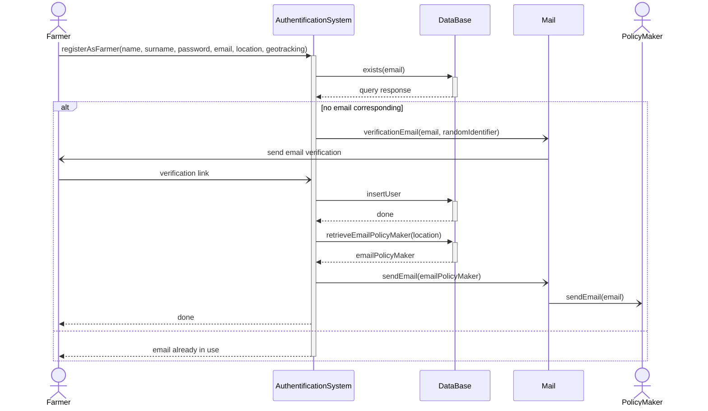
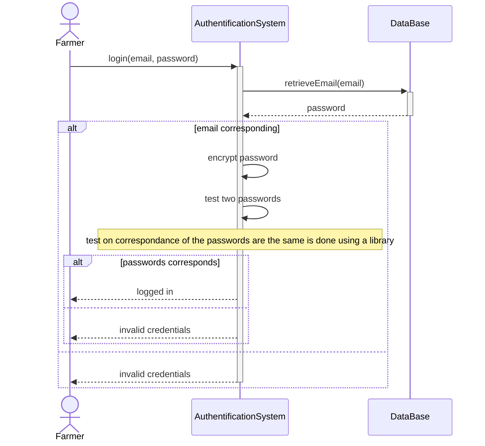
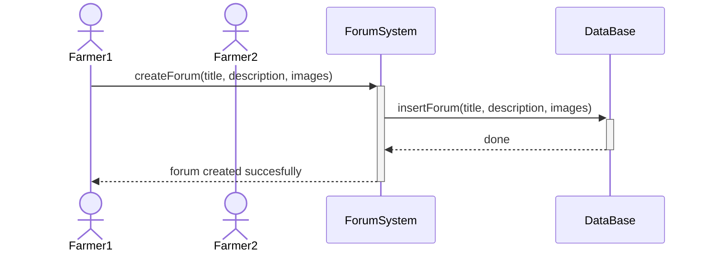
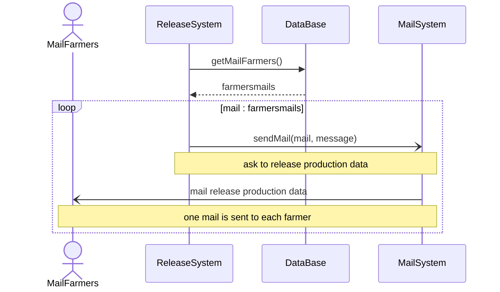
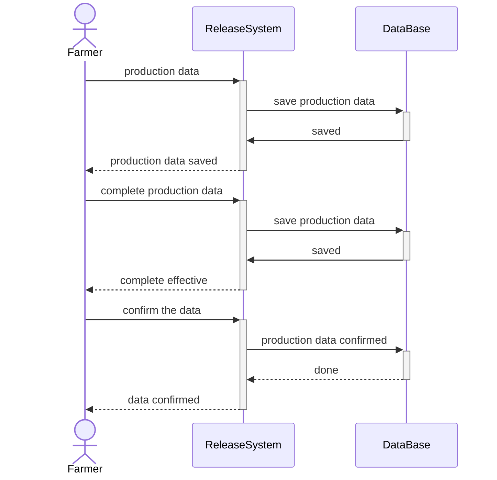
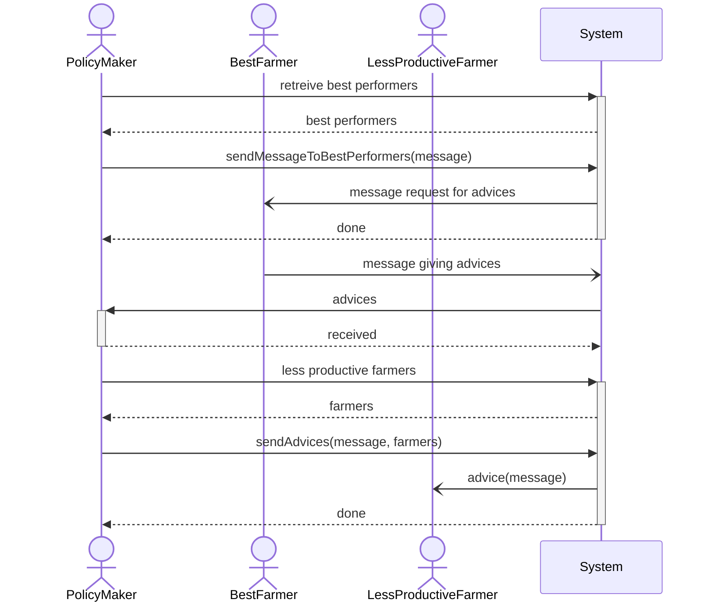

# UML diagram
## registration

## login

## Forum Creation

## send mail asking for prod data

## Request for Production Data
before that the system gets the mail of the farmers and does a loop

## Contact farmers

